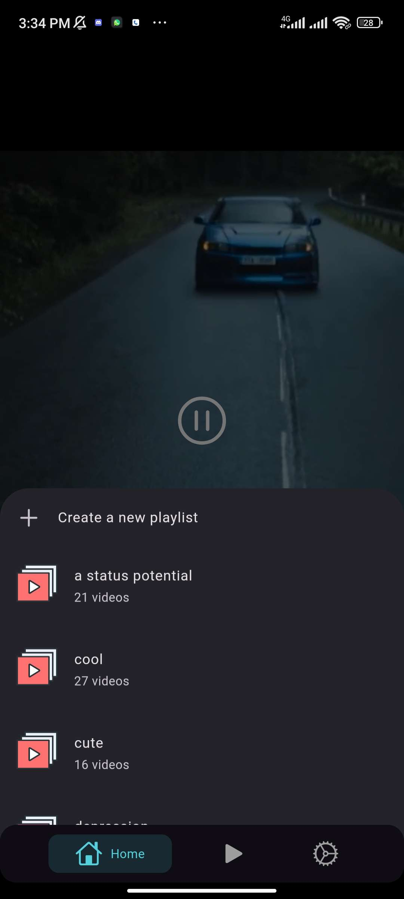
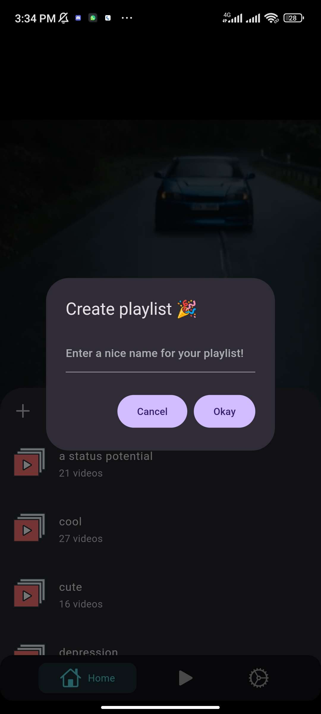
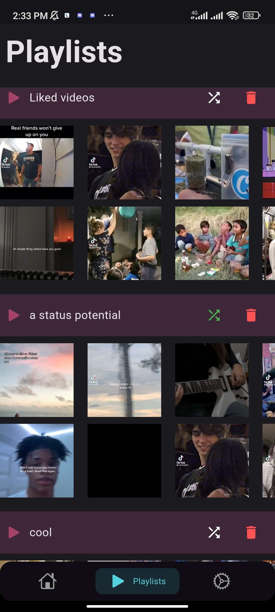

 


> This is my first Flutter project

> This project is incomplete, so it could have bugs

## Introduction

**Scroll** is a simple app that lets you play videos from your gallery randomly like tiktoks. You can save them to custom playlists, like them, share, etc.


The application is written using the Flutter framework.

Packages used:
  * cupertino_icons: ^1.0.2
  * persistent_bottom_nav_bar: ^5.0.2
  * video_player: ^2.8.2
  * tiktoklikescroller: ^0.2.6
  * photo_gallery: ^2.1.1
  * permission_handler: ^11.0.1
  * rive: ^0.12.4
  * smooth_video_progress: ^0.0.4
  * like_button: ^2.0.5
  * sizer: ^2.0.15
  * hive: ^2.2.3
  * hive_flutter: ^1.1.0
  * path_provider: ^2.1.0
  * toast: ^0.3.0
  * share_plus: ^7.2.1
  * video_thumbnail: ^0.5.3
  * provider: ^6.1.1

## screenshots:

   

## Compiling from source

### Clone the project

```sh
git clone https://github.com/yetimeh/scroll
```

### Build apk

```sh
flutter build apk --release
```
